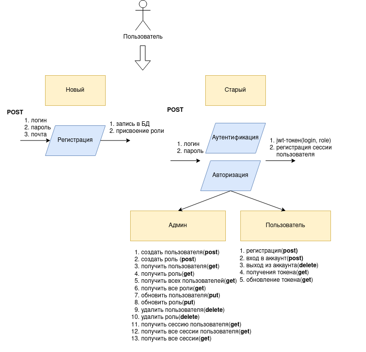
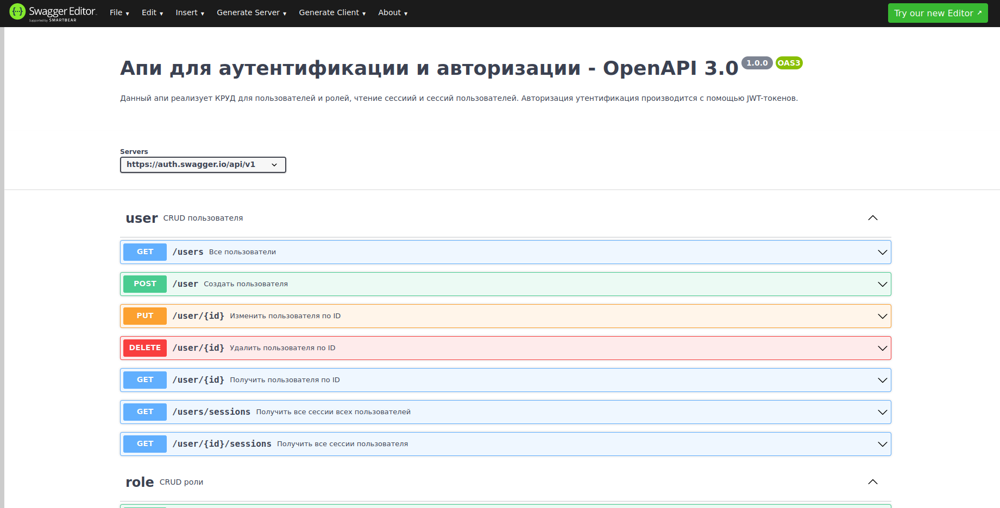

# Сервис авторизации и аутентификации

## Описание:
Сервис реализует аутентификацию и авторизацию пользователей с помощью JWT-токена
При входе пользователя в аккаунт с помощью логина+пароля создается сессия, выясняется роль пользователя (админ или обычный пользователь); 
в соответствии с ролью генерируется сигнатура токена; генерируется пара ```access, reresh``` токенов и отдается пользователю; С помощью ```access``` токена производится авторизация пользователя при запросах к апи; Если срок действия ```access``` токена истек, то предусмотрено генерирование новой пары ```access, reresh``` токенов при предъявлении ```refresh``` токена.

## Сборка проекта:
1. при первом запуске: ```docker compose -f docker-compose.dev.yml up --build```<br>
2. поднять с прогнкой тестов: ```docker compose -f docker-compose.dev.yml up --build --exit-code-from tests_unit```
2. при последующих: закомментировать ```alembic revision --autogenerate -m 'Initial migration.'``` в ```docker-entrypoint.dev.sh```    

## Логическая схема сервиса


## Cваггер схема сервиса


## Технологии:

|технология|причина применения|
|---|---|
|flask|основной фреймворк, достаточно быстрый, если не перегружать плагинами)| 
|postgres|БД для пользователей, ролей, сессий|
|redis|БД для jwt-токена|
|jwt|инструмент для работы с jwt-токеном|
|sqlalchemy-marshmallow|инструмент для валидации и сериализации/десериализации данных|

## Демонстрация ответов апи:

|описание|запрос|
|---|---|
|создать пользователя|curl -X POST -H 'Content-Type: application/json'  -d '{"login": "testlogin", "password":"Test638?asd"}' http://172.23.0.4:5000/admin/user|
|прочитать пользователя по айди|curl GET http://172.23.0.4:5000/admin/user/<uuid:id>|
|прочитать всех пользователей|curl GET http://172.23.0.4:5000/admin/users|
|обновить пользователя|curl -X PUT -H 'Content-Type: application/json'  -d '{"login": "test", "password":"test", "email":"email@email.test"}' http://172.23.0.4:5000/admin/user/<uuid:id>|
|удалить пользователя|curl -X DELETE http://172.23.0.4:5000/admin/user/<uuid:id>|
|аналогично для ролей||
|получить сессии пользователя|curl GET http://172.23.0.4:5000/admin/user/<uuid:id>/sessions|
|получить сессии всех пользователей|curl GET http://172.23.0.4:5000/admin/users/sessions|
|обновить токен|curl -X POST -H Authorization:"Bearer $REFRESH_TOKEN" http://172.23.0.4:5000/token/refresh|
|зарегистрировать аккаунт|curl -X POST -H 'Content-Type: application/json'  -d '{"login": "user2", "password":"123qwe"}' http://172.23.0.4:5000/sign/up|
|войти в аккаунт|curl -X POST -H 'Content-Type: application/json'  -d '{"login": "user2", "password":"123qwe"}' http://172.23.0.4:5000/sign/in|
|выйти из аккаунта|curl -X DELETE -H "Authorization: Bearer {token}" http://172.23.0.4:5000/sign/out|
|информация о пользователе|curl -X GET -H "Authorization: Bearer {token}" http://172.23.0.4:5000/sign/me|


## Усовершенствование
1. вести [логи](https://flask.palletsprojects.com/en/2.2.x/logging/) сессий в редисе; если пользователь неактивен в течение 30 минут, то сессия закрывается и логи переливаются в ```mongoDB```, ключ из монго добавляется в таблицу с сессиями пользователя


## TODO
- [x] добавить аннотации типов
- [x] коммитить sqlalchemy на уровне сервиса и репозитория
- [x] добавить исключения
- [x] добавить swagger документацию

## Чеклист

* API для сайта и личного кабинета

- [x] регистрация пользователя;
- [x] вход пользователя в аккаунт (обмен логина и пароля на пару токенов: JWT-access токен и refresh токен);
- [x] обновление access-токена;
- [x] выход пользователя из аккаунта;
- [x] изменение логина или пароля (с отправкой email вы познакомитесь в следующих модулях, поэтому пока ваш сервис должен позволять bзменять личные данные без дополнительных подтверждений);
- [x] получение пользователем своей истории входов в аккаунт;

* API для управления доступами

- [x] создать роль
- [x] изменить роль
- [x] удалить роль
- [x] просмотр всех ролей
- [x] назначить пользователю роль
- [x] отобрать у пользователя роль
- [x] метод для проверки наличия прав у пользователя.


